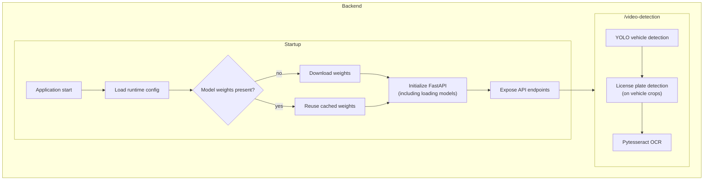
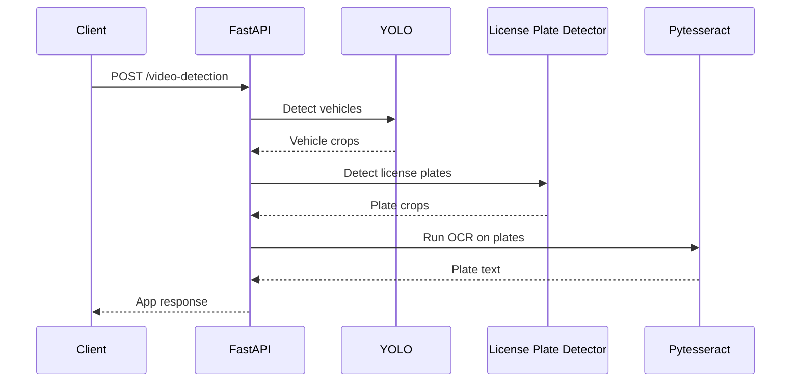

# Pl8Catch – License Plate Recognition Demo Stack

Pl8Catch is an end‑to‑end, reproducible example of a license plate recognition system: detect vehicles, isolate plates, extract text, and stream structured + visual results.

It showcases:
- Training a YOLO model for plate detection
- A FastAPI backend exposing a streaming inference endpoint
- A lightweight Streamlit frontend for interactive demo
- MLflow experiment tracking (parameters, metrics, artifacts, code snapshot)

If the dataset isn’t present locally, it is downloaded automatically from Roboflow (requires `ROBOFLOW_API_KEY`).

> Model Weights: The fine‑tuned license plate detection model is published on Hugging Face at: https://huggingface.co/danielhcsousa/pl8catch, however the main repository for this project is still this one. The base YOLOv12 `yolo12s.pt` weights can be fetched from the Ultralytics public assets. HuggingFace was used to make sure this repository is not overloaded with large binary files, also for convenience since it provides easy versioning and download links.

---

## Features

- **YOLO-based detection** – (current weights: YOLOv12 variant) for vehicles & plates
- **OCR extraction** – parse plate text from detected crops
- **FastAPI backend** – single streaming endpoint for metadata + annotated frames
- **Streamlit demo frontend** – not production‑focused; illustrates API usage
- **MLflow tracking** – metrics, params, artifacts, & model lineage

> Note: The FastAPI backend (streaming inference endpoint, config handling, and deployment artifacts) is the primary, optimized focus of this repository. The Streamlit frontend is intentionally minimal and exists solely to demonstrate the API.

---

## Backend Architecture Overview



This diagram focuses on runtime behavior. On startup the backend loads `configs/backend.yaml`, ensures the local model exists (downloading any missing weights referenced by the config), and then exposes the `/video-detection` FastAPI endpoint among others.

### Request Sequence: `/video-detection`



The sequence diagram highlights the happy-path exchange between the frontend client and backend processing stack when invoking the `/video-detection` endpoint. Each step maps to the components shown in the architecture graph above, illustrating how vehicle detections feed the nested plate detector and, ultimately, OCR extraction before results stream back to the caller.

The frontend built for this demo submits a video source URL (file path, webcam index, or stream URL) and parses the multipart response to display both structured JSON results and annotated frames in real time or near real time.

---

## Training (with MLflow)

Ultralytics provides native MLflow integration, so runs automatically log metrics, params, and artifacts.

1. (Optional) Start a local tracking server (or export `MLFLOW_TRACKING_URI` to an existing one):

   ```bash
   mlflow server --backend-store-uri mlflow
   ```

2. Launch training (uses `configs/train.yaml` + environment overrides):

   ```bash
   python src/training/train.py
   ```

Tune epochs, batch size, image size, etc. via `configs/train.yaml` or corresponding environment variables/CLI overrides (see `TrainConfig`).

Heads‑up:
- Dataset path expected at `downloaded_dataset/data.yaml`
- If missing, the script pulls from Roboflow using `ROBOFLOW_API_KEY`
- Optional overrides: `ROBOFLOW_WORKSPACE`, `ROBOFLOW_PROJECT`, `ROBOFLOW_VERSION`, `ROBOFLOW_EXPORT_FORMAT`

Refer to [Roboflow](https://roboflow.com/) for API key creation and dataset management.

---

## Dataset

The dataset used for training the model can be found [here](https://universe.roboflow.com/roboflow-universe-projects/license-plate-recognition-rxg4e/dataset/4).

---

## Execution Overview

### Task Automation (Justfile)

The `justfile` consolidates repeated commands (like formatting, tests, container build) behind concise recipes.

Install `just` (macOS / Homebrew):
```bash
brew install just
```

List available recipes:

```bash
just
```

Typical commands (see the file for the authoritative list):

| Recipe | Purpose |
|--------|---------|
| `venv` | Sync all dependency groups into local `.venv` |
| `pre-commit` | Run formatters, linters, type checks |
| `test` | Execute full test suite |
| `clean` | Remove caches and virtual environment (interactive) |
| `docker-build` | Build container image (override TAG / IMAGE_NAME / REGISTRY) |
| `docker-run` | Run container with mounted config & env file |


Using a `justfile` keeps command logic centralized and avoids memorizing long flags.

### Backend

Run the FastAPI backend (dev mode hot-reload example shown):

```bash
uvicorn pl8catch.app:app --reload --port 8000
```

Or equivalently:

```bash
python src/pl8catch/app.py
```

The service exposes a single streaming endpoint combining detections + annotated frames without double inference:

```
POST /video-detection
Content-Type: application/json
Body: {"source": "<video source>"}
Response: multipart/mixed; boundary=frame
```

Each processed frame yields two sequential parts under a shared boundary:
1. `application/json` – `{ "frame_index": <int>, "detections": [ ... ] }`
2. `image/jpeg` – annotated frame bytes

Why `multipart/mixed` (vs Server-Sent Events):
- Keeps frame metadata + pixels aligned (single inference per frame)
- Simple to extend (insert periodic stats JSON parts)

### Frontend

Launch the demo UI:

```bash
streamlit run src/frontend/app.py
```

The client submits to `/video-detection` with a JSON body containing `source` and parses the alternating JSON + JPEG stream. Set `PL8CATCH_BACKEND_ENDPOINT` (e.g. `http://localhost:8000`) in your `.env` or shell environment.

---

## Docker / Container Image

You can build and run the backend inside a container. The `Dockerfile` uses a multi-stage build process to ensure a lightweight final image. It now builds only application code & dependencies (no baked model weights) on top of the `astral/uv` Python 3.12 base. At container startup the application will:

1. Ensure a writable model directory (default: `/app/models`).
2. Check for presence of required weight files.
3. Download each missing weight from its configured URL (with basic size logging) before loading into memory.

This reduces image size, speeds up CI builds (no large binary layers), and allows hot‑swapping model versions via startup configurable variables without rebuilding the image.

### Published Image

Pre-built multi-arch (amd64/arm64) images are published automatically to GitHub Container Registry (GHCR) on pushes to the default branch and on semantic version tags (`vX.Y.Z`).

Repository: `ghcr.io/dhcsousa/pl8catch`

Available tag patterns:

| Tag | Source |
|-----|--------|
| `latest` | Default branch build |
| `sha-<short>` | Every push (immutable) |
| `vX.Y.Z` | Git tag push (semantic version) |
| `vX.Y` | Convenience minor tag from `vX.Y.Z` |
| `vX` | Convenience major tag from `vX.Y.Z` |

Pull the latest image:

```bash
docker pull ghcr.io/dhcsousa/pl8catch:latest
```

### Build Image (Manual)

Use the convenience recipe (builds `pl8catch:latest` for `linux/amd64`):

```bash
just docker-build
```

### Run Container

The app listens on container port `8000` (mapped to host `:8000`). A runtime config file is mounted read‑only, with its path passed via `CONFIG_FILE_PATH` (see Helm values). Use the recipe:

```bash
just docker-run
```

### Runtime Model Download

Model sources are declared in the runtime configuration file (defaults to `configs/backend.yaml`). Both
`models.object_detection` and `models.license_plate` accept either a local filesystem path or an HTTP(S)
URL:

- **Local path** – the file is expected to be present already (relative paths resolve from the
   configuration file’s directory).
- **Remote URL** – the model weights are downloaded on startup into the model directory before loading.

If you want to fetch the base YOLO weights at runtime, update the config like so:

```yaml
models:
   object_detection: "https://github.com/ultralytics/assets/releases/download/v8.3.0/yolo12s.pt"
   license_plate: "https://huggingface.co/danielhcsousa/pl8catch/resolve/main/license_plate_model.pt"
```

Relevant environment variables:

| Variable | Default | Purpose |
|----------|---------|---------|
| `CONFIG_FILE_PATH` | `<repo>/configs/backend.yaml` (container: `/app/configs/backend.yaml`) | Location of the YAML file that defines model URLs/paths and OCR settings. |
| `MODEL_DIR` | `<repo>/models` (container: `/app/models`) | Destination directory for any downloaded weights. Created automatically if missing. |

Weight files that already exist inside `MODEL_DIR` are reused untouched—ideal for persistent volumes in
container deployments. Any download failure causes startup to abort so issues are surfaced immediately.

### Image Contents (Summary)

- Python 3.12 (Debian bookworm) via `astral/uv`
- Pre-synced virtual environment at `/app/.venv`
- No large model layers baked in (download on first start)
- Command: `uvicorn pl8catch.app:app --host 0.0.0.0 --port 8000`

---

## Helm Chart (Kubernetes Deployment)

A lightweight Helm chart is included under `charts/` to deploy the FastAPI backend. It provisions:

- Deployment (+ probes hitting `/health`)
- ConfigMap with the application config (`config.yaml`)
- Service (ClusterIP by default)
- Optional Ingress (disabled by default)

### Quick Install

From the repo root (an image matching `values.yaml` defaults already exists on GHCR if CI has run):

```bash
helm upgrade --install pl8catch ./charts \
  -n pl8catch --create-namespace \
  --set image.tag=latest
```

### Updating Application Config

The ConfigMap content derives from `app.config` in `values.yaml`. To change OCR thresholds or model paths:

```bash
helm upgrade pl8catch ./charts --set app.config.license_plate_ocr.resizing_threshold=20000
```

Kubernetes projects a refreshed `config.yaml` into the pod; rollout is automatically triggered via the included config hash annotation.

### Uninstall

```bash
helm uninstall pl8catch
```

---

## Roadmap / Ideas

- (DONE) Publish pre-built images to GHCR with CI-generated semantic tags
- Model versioning + on-start selective download (replace bundled weights)

Contributions welcome—open issues or PRs for discussion.

---

## License

This project combines several components with distinct licensing considerations:

| Component | Source / Notes | License |
|-----------|----------------|---------|
| Application code (this repo) | `pl8catch` backend, config, demo frontend | MIT |
| Ultralytics YOLO (e.g. YOLOv12) | Training / inference library & exported weights | AGPL-3.0 |
| Roboflow dataset | License Plate Recognition dataset (download via API) | CC BY 4.0 (attribution required) |
| Streamlit | Frontend framework | Apache-2.0 |
| FastAPI / Pydantic / Uvicorn | Backend stack | MIT / BSD / Apache-2.0 |
